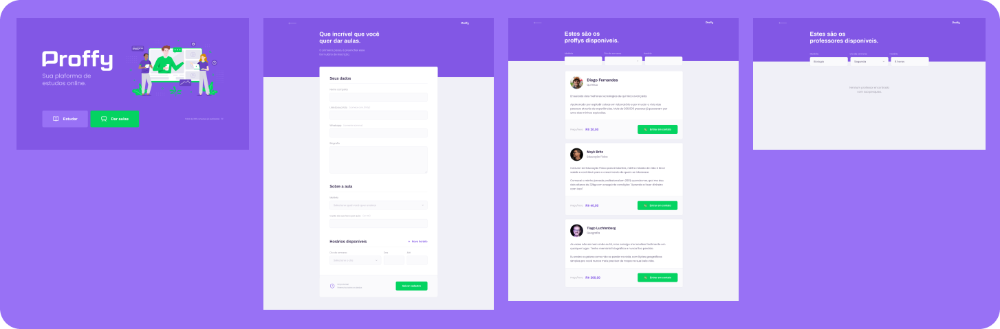

<h1 align="center">
  
  <br />
</h1>
<p align="center">
 <a href="#description">Descrição</a> •
 <a href="#design">Design</a> • 
 <a href="#features">Funcionalidades</a> • 
 <a href="#database">Banco de dados</a> •
 <a href="#tecnologias">Tecnologias</a> •
 <a href="#install">Instalação</a> •
 <a href="#license">Licença</a> • 
 <a href="#author">Autor</a> •
</p>
<p align="center" id="description">
  Proffy e uma plataforma de aulas online, com o proffy você tem a opção de ser um estudante ou um professor, a
  plataforma tem sua versão Web e a sua versão Mobile.
  Este projeto foi feito no Next Level Week#2 by Rocketseat, foi nesse evento com uma semana de duração, que foi construida está aplicação.
</p>
<h1 align="center" id="design">
  
  <br />
</h1>

<h2 id="features">
  Features
</h2>

### Web

- [x] Opção de estudar ou dar aulas.
- [x] Fórmulario para cadastro de professores.
- [x] Fitragem de professores.
- [x] Entrar em contado com os professores pelo Whatsapp.

<h2 id="database">
  🗄 Banco de dados
</h2>
Foi utilizado o SQLite <a href="https://www.sqlite.org/">SQLite</a>

<h2 id="tecnologias">
  🛠 Tecnologias
</h2>

 As seguintes ferramentas foram usadas na construção do projeto:

- [HTML]
- [Nunjucks](https://mozilla.github.io/nunjucks/)
- [Node.js](https://nodejs.org/en/)

<h2 id="install">
   📜️ Instalação
</h2>

### Pré-requisitos

Antes de começar, você vai precisar ter instalado em sua máquina as seguintes ferramentas:
[Git](https://git-scm.com) e [Node.js](https://nodejs.org/en/)
Além disto é bom ter um editor para trabalhar com o código como [VSCode](https://code.visualstudio.com/)

### 🎲 Rodando o Back End (servidor)

```bash

# Clone este repositório
$ git clone <git@github.com:FeSilva-dev/Proffy-Web.git>

```

### 💻️ Rodando o Front End (plataforma web)

```bash

# Instale as dependências
$ npm install or yarn install

# Execute aplicação
npm run dev or yarn run dev

# O app vai está rodando na porta 5500 - acesse <http://localhost:5500>
```

<h2 id="author">
   👷️ Autor
</h2>

<a href="https://github.com/FeSilva-dev">
 
 <br />
 <sub><b>Felipe Silva</b></sub>
</a>


Feito com carinho por Felipe Silva 👋🏽 Entre em contato!🚀

<h2 id="license">
  📝 Licença
</h2>

Copyright © 2020 [Felipe Silva](https://github.com/FeSilva-dev).<br />
This project is [MIT](./LICENSE.txt) licensed.
